**Incubyte Assessment Project**  
# 🍬 Sweet Shop Management System

A full-stack web application for managing a sweet shop, built with **React**, **Node.js**, **Express**, and **MongoDB**. The system includes user and admin dashboards, JWT-based authentication, TDD-based development, and dynamic sweet inventory handling.

---

## 📸 Screenshots

> Add these images to your repo under `/screenshots` and use the following Markdown syntax:

```md
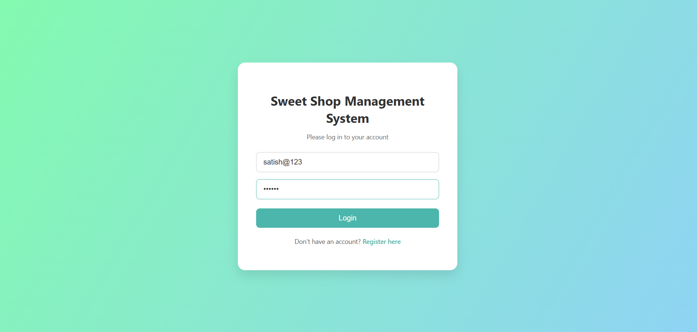
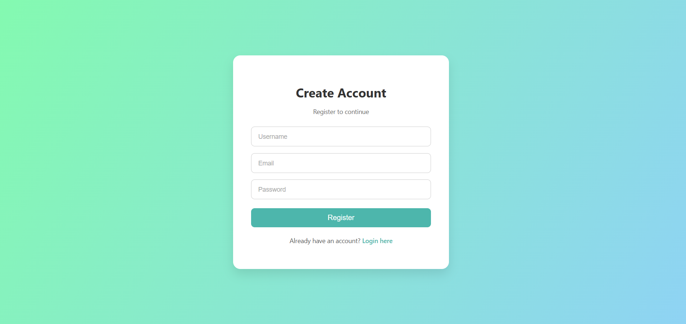
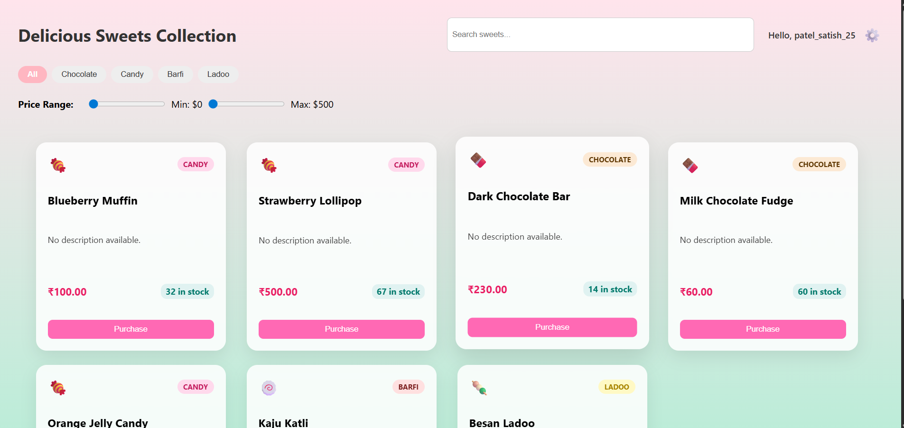
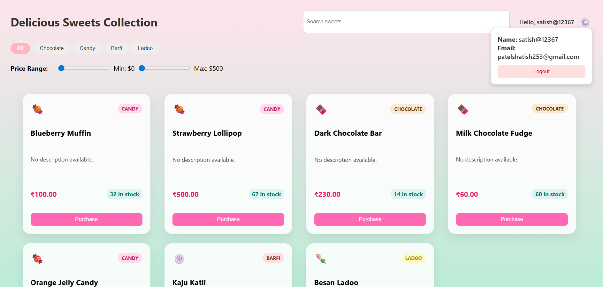
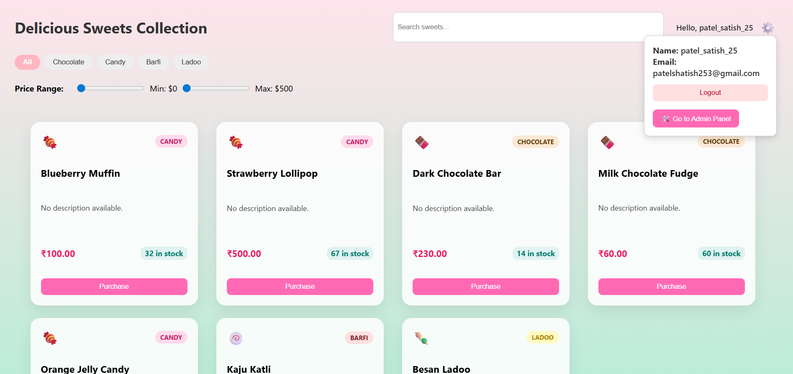
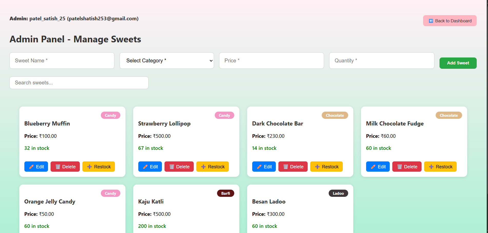
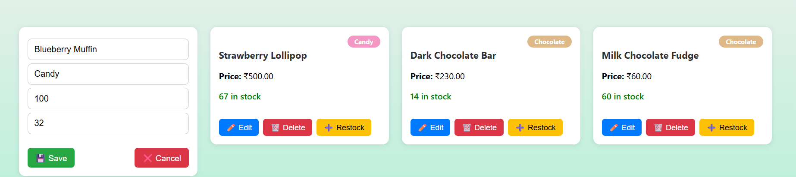
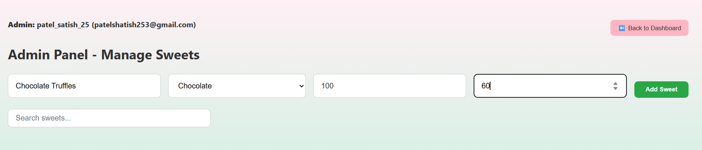
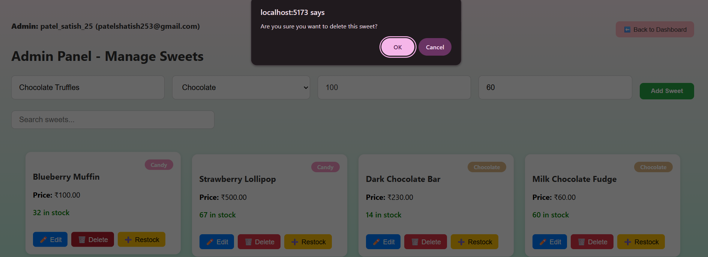
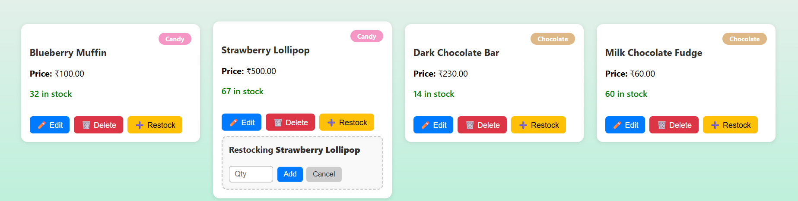
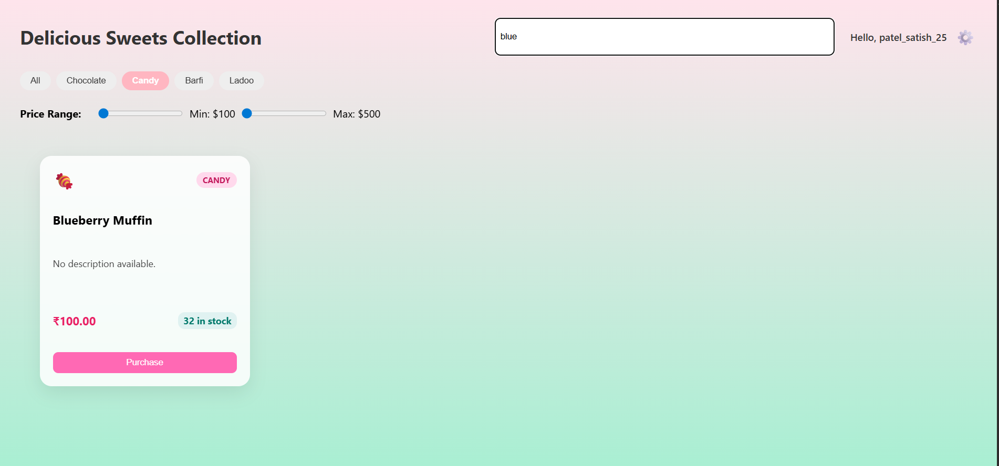
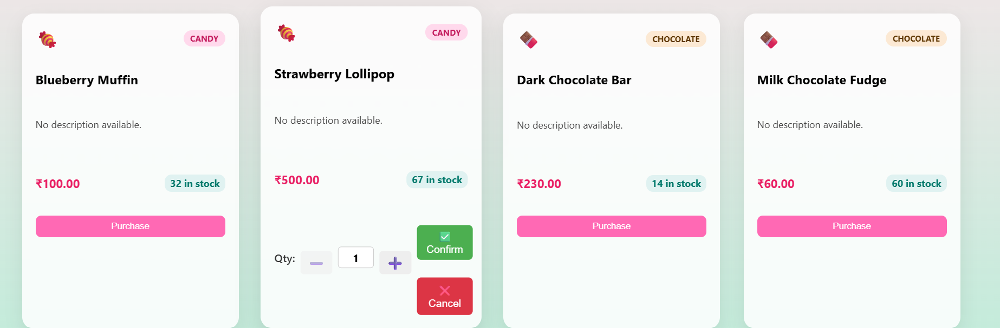


```

---

## ✨ Features

### 👤 Authentication
- User registration & login
- Role-based access control (User/Admin)
- JWT token validation

### 🛍️ User Dashboard
- View sweets with icons by category 🍫🍬🍡🍥
- Live stock quantity display
- Purchase with quantity selector
- Friendly purchase confirmation toast
- Filters:
  - Search by name
  - Filter by category
  - Price range slider (API-based filtering)

### 🧑‍💼 Admin Panel
- Add new sweets (form with validations)
- Edit sweet details inline
- Delete sweets
- Restock sweets
- Real-time inventory updates

---

## ⚙️ Tech Stack

| Layer        | Technology         |
|--------------|--------------------|
| Frontend     | React, CSS         |
| Backend      | Node.js, Express   |
| Database     | MongoDB, Mongoose  |
               | mongodb-memory-server
| Auth         | JWT                |
| Testing      | Jest, Supertest    |
| Deployment   | Localhost / GitHub |

---

## 📂 Project Structure

```
incubyte-sweet-shop/
├── backend/
│ ├── node_modules/
│ ├── src/
│ │ ├── controllers/
│ │ ├── model/
│ │ ├── routes/
│ │ ├── app.js
│ │ ├── mongodbcon.js
│ │ └── utheticatoin.js
│ ├── test/
│ │ ├── auth.test.js
│ │ ├── inventory.test.js
│ │ ├── mongodbcon.test.js
│ │ ├── setUp.js
│ │ ├── Sweet.test.js
│ │ └── testUtils.js
│ ├── package.json
│ └── package-lock.json
│
├── sweet-shop-frontend/
│ ├── node_modules/
│ ├── public/
│ ├── src/
│ │ ├── assets/
│ │ ├── context/
│ │ ├── pages/
│ │ │ ├── AdminPanel.jsx
│ │ │ ├── AdminPanel.css
│ │ │ ├── Dashboard.jsx
│ │ │ ├── Dashboard.css
│ │ │ ├── Login.jsx
│ │ │ └── Login.css
│ │ ├── Register.jsx
│ │ ├── App.jsx
│ │ ├── App.css
│ │ ├── index.css
│ │ └── main.jsx
│ ├── index.html
│ ├── vite.config.js
│ ├── eslint.config.js
│ ├── package.json
│ └── package-lock.json
│
├── .gitignore

```

---

## 🚀 Getting Started

### Backend
```bash
cd backend
npm install
npm install -g nodemon
nodemon src/app.js
```

### Frontend
```bash
cd frontend

npm run start
```


---

## ✅ API Endpoints

### Auth
- `POST /api/auth/register`
- `POST /api/auth/login`

### Sweets (Protected)
- `GET /api/sweets`
- `POST /api/sweets`
- `PUT /api/sweets/:id`
- `DELETE /api/sweets/:id`
- `POST /api/sweets/:id/restock`
- `POST /api/sweets/:id/purchase`
- `GET /api/sweets/search?name=&category=&minPrice=&maxPrice=`

---

## 🧪 Test Coverage
- API Unit Tests using **Jest + Supertest**
- Validations and error handling tested
- CRUD operations covered

---

## 🧠 Project Highlights
- Fully responsive modern UI
- TDD-compliant development flow
- Real-time updates after add/edit/restock/purchase
- Clean modular code architecture
- Professionally styled form validations and toast alerts

---

## 📌 Final Commit Message

```bash
git commit -m "feat: Complete Sweet Shop Management System 🎉

- Finished Admin Panel:
  - Add, edit, delete, restock sweets
  - Admin dashboard UI polish
  - Category dropdown, validation, and responsive layout

- Finished User Dashboard:
  - View sweets with real-time stock
  - Purchase functionality with quantity selector
  - API-integrated search, category filter, and price range filter

- Added backend filtering route `/api/sweets/search` with support for:
  - name (regex)
  - category (skips \"All\")
  - price range (minPrice, maxPrice)

🎯 Project completed and ready for submission.

Co-authored-by: ChatGPT <chatgpt@users.noreply.github.com>"
```

---

## 👤 Author

**Satish Patel**  
MCA Student - gujarat university department of computer science
Email: patelshatish253@gmail.com
GitHub: [github.com/satishpatel](https://github.com/patelsatish25)

Submitted as part of the **Incubyte Assessment** - AI Kata TDD Project.

---


